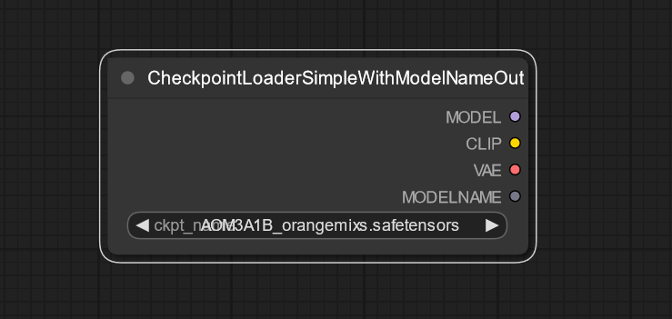

# Custom Nodes For ComfyUI

This Python script uses with ComfyUI. These nodes were created mainly for the purpose of processing the same prompt, seed when they are generated together with different checkpoint, etc and saving the results with the sampler parameter in a file name.

---

## CheckpointLoaderSimpleWithModelNameOut

## CLIPTextEncodeWithTextInput

## KSamplerWithSeedInputParamOutput

## SaveImageWithParam

## SeedNode

## TextInput

---

## Requirements

- ComfyUI

To install:

Put the files into `ComfyUI/custom_nodes`

## Contributing

Contributions are welcome! If you have any suggestions for improvements or bug fixes, please submit a pull request or open an issue on the project's repository.

## License

This project is licensed under the MIT License. For more information, see the [LICENSE](./LICENSE) file in the project's repository.

